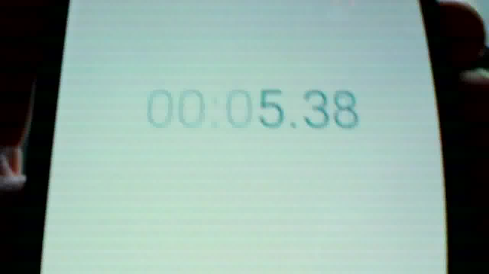
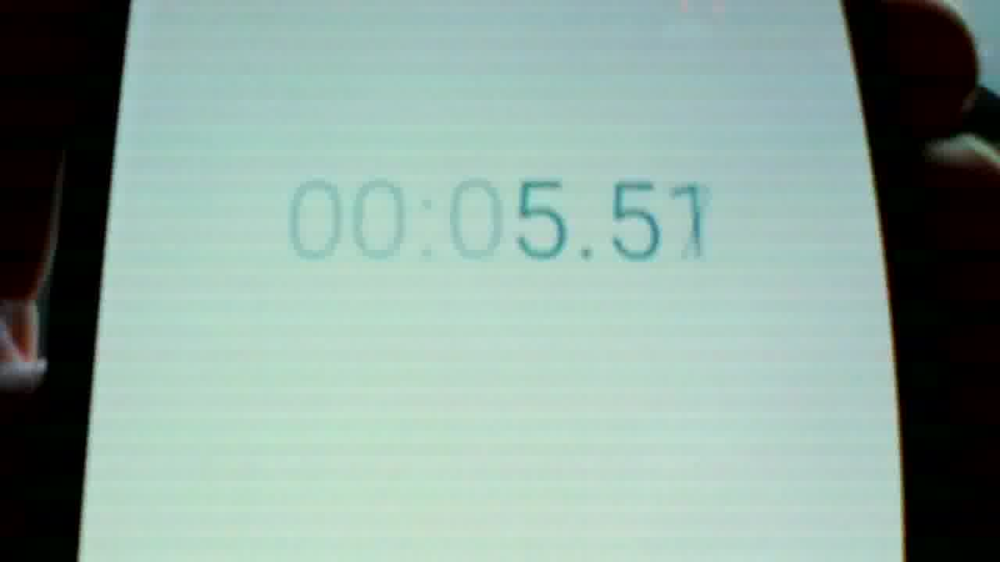
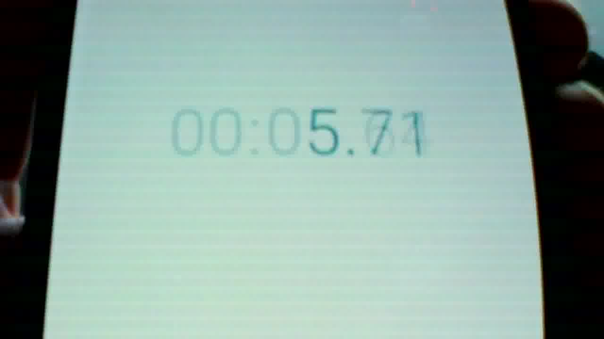
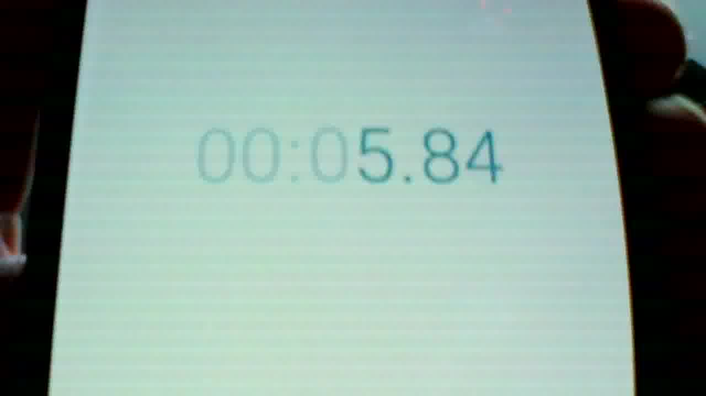

# GL864A_OV5640_Linux
Issues relating to Genesys Logic GL864A custom firmware for OV5640 module and Linux UVC driver

## Linux OS

Linux raspberrypi 4.4.50+ #970 Mon Feb 20 19:12:50 GMT 2017 armv6l GNU/Linux

Distributor ID:	Raspbian
Description:	Raspbian GNU/Linux 8.0 (jessie)
Release:	8.0
Codename:	jessie

## Firmware 20171014

Found that this worked with Windows 10, but could only be made to work
very infrequently with Linux. Some sort of timeout error happening during
the initial setup of the video connection.

## Firmware 20171030

This version has has moved us forward from generally unusable with Linux
to being usable under certain conditions. However some issues remain that
we really must resolve before we can signoff.

### Connection to camera sometimes fails

We are still experiencing connection problems to the camera. When using a slower CPU (a Raspberry Pi Compute Module 1) this works typically in one or two tries. On the newer faster Raspberry Pi Compute Module 3 it can be made to work very rarely (maybe on in 20 or 30 tries).

Researching problems with Linux + UVC cameras a common cause of problems is missing UVC functionality. We ran the official USB2 tests on the GL864 firmware and compared with the GL864 Eval Board. Our firmware failed, but the eval board passed. I suspect this may be the root cause of the reliability problems. 

These are the rest reports:

 * [UVC Functionlity Test FW_20171030 GL864A PID 0x0510](https://jdesbonnet.github.io/projects/GL864/FW_OV5640_B03_ISO_20151030/UVC%20Functionality%20Tests%20-%20Failed%20-%202017-11-12%2012-37-33.html)
 * [UVC Functionlity Test FW 20171030 GL864A PID 0x0515](https://jdesbonnet.github.io/projects/GL864/FW_OV5640_B03_ISO_20151030/UVC%20Functionality%20Tests%20-%20Failed%20-%202017-11-12%2012-41-57.html)
 * [UVC Functionlity Test Eval Board](https://jdesbonnet.github.io/projects/GL864/FW_OV5640_B03_ISO_20151030/UVC%20Functionality%20Tests%20-%20Passed%20-%202017-11-12%2012-44-43.html)

The errors seem to indicate that some mandatory services are missing. These are:

 * Video Control does not support the mandatory request : SET_CUR
 * Video Control does not support the mandatory request : GET_RES
 * Video Control does not support the mandatory request : GET_INFO
 * Video Control does not support the mandatory request : GET_DEF

(see reports above for details).

The firmware on the GL864 eval board does pass all the tests (report also linked above).

### Frame rate issue

We are seeing something in the order of 3 frames per second. This has been
observed on Windows 10. The following is a few successive frames recorded
with the video record feature of Zoom Meeting.

## Links of interest

* [USB2 tests](http://www.usb.org/developers/tools/usb20_tools/#usb20cv)
* http://www.genesyslogic.com/en/product_view.php?show=44
* http://www.usb.org/developers/tools/usb20_tools/#usb20cv

